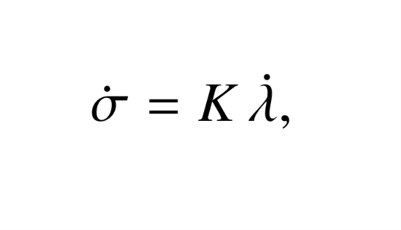
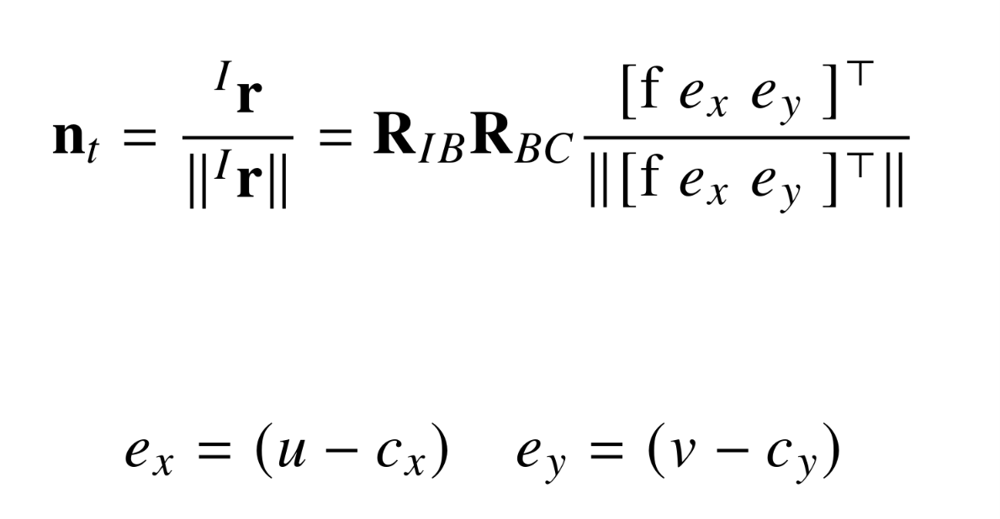

# Multicopter Interception via Image-Based Visual Servoing (SITL)

This repository is a software-in-the-loop (SITL) simulation environment
built for my master's thesis, exploring image-based visual servoing (IBVS)
guidance for autonomous multicopter interception of a maneuvering aerial
target. It uses **PX4** (flight stack in SITL) + **AirSim** (simulator and
target/camera environment) + **MAVSDK** (offboard control from Python).

The guidance approach is based on the ideas presented in **H. Yan, K. Yang,
Y. Cheng, Z. Wang, and D. Li, "Precise Interception Flight Targets by
Image-Based Visual Servoing of Multicopter," IEEE Transactions on
Industrial Electronics, 2025** (arXiv:2409.17497). This work
combines an IBVS controller with a proportional navigation guidance (PNG)
law, and includes a field-of-view
holding controller so the target doesn't drift out of frame during the
terminal approach. This project reimplements the core PNG-IBVS guidance
idea in a SITL environment as a first step before any hardware testing.


---

## How the simulation is structured

`PX4_SITL.py` runs two AirSim vehicles concurrently:

- **`Drone2` -the target-** (`run_drone2_launch`). A secondary AirSim
  multirotor (`simpleflight`) spawned at runtime, armed, taken off, climbed
  to altitude, then set on a constant-velocity escape move
  (`moveByVelocityAsync`). This stands in for a maneuvering intruder.
- **The PX4 vehicle — the interceptor** (`run_px4_interception`). Armed
  and taken off itself via `drone.action`, then switched into MAVSDK
  offboard mode. Each control-loop iteration:
  1. grabs a camera frame and runs AirSim's detection filter
     (`detect_target`, filtered to `Drone*`/`Cylinder*` mesh names) to get
     the target's bounding-box pixel centroid `(u, v)`,
  2. converts that pixel into a line-of-sight (LOS) unit vector in world
     NED using the pinhole model and the camera's current world pose
     (`pixel_to_NED_LOS`),
  3. converts the LOS vector to elevation/azimuth angles (`vec_to_angles`),
  4. applies the PNG-IBVS law below to get a commanded velocity direction,
     scales it by a saturated closing speed, rotates it into the body
     frame, and sends it as `VelocityBodyYawspeed` with a small
     proportional yaw term keeping the target centered in frame,
  5. logs every iteration's LOS/command angles and velocities to
     `png_log.csv`, and plots them (`plot_png_log`, `plot_velocity_log`)
     once the run ends.

---

## Guidance law: PNG-IBVS

Classical proportional navigation (PN) guidance commands an interceptor to
null the **rotation rate of the line of sight (LOS)** to the target. If the
LOS direction stops rotating while range is closing, the two are on a
collision course. In an image-based visual servoing scheme, the LOS is
measured directly from the camera image rather than from a separate
navigation/estimation solution — the target's pixel position *is* the LOS
measurement.

The underlying PNG law is:




- **lambda_dot**: the LOS rotation rate, per axis (elevation,
  azimuth).
- **sigma_dot**: the commanded velocity rotation rate, per axis (elevation,
  azimuth).
- **k**: the proportional navigation gain (`k = 3` in this
  implementation). Larger `k` reacts to LOS drift more aggressively but is more
  sensitive to detection noise.

In code, this is implemented in its integrated angle form
`sigma = k * lamda + sigma_offset` where `sigma_offset` is a constant initialization
fixed once at the first detection (`lamda_0`) so that the initial commanded
direction matches the vehicle's actual initial heading/geometry.

### Getting λ from pixel coordinates: the pinhole model

Each detection gives a target centroid in pixel coordinates `(u, v)`. In
`pixel_to_NED_LOS`, the pinhole model turns that into a LOS unit vector
in the **Earth NED frame**:



That vector is then rotated from the camera frame into world NED using the
camera's current orientation quaternion (`simGetCameraInfo` →
`quat_to_rot_world2local`, transposed since camera→world is the inverse of
world→camera). `vec_to_angles` then converts the resulting world-frame LOS
vector into elevation/azimuth:

```
elevation = atan( z / sqrt(x² + y²) )
azimuth   = atan2( y, x )
```

This `λ = [elevation, azimuth]` is what feeds `sigma = k·λ + sigma_offset` each
iteration, and `angles_to_vec` converts the resulting commanded `sigma`
back into a unit direction vector for the velocity command.

---

## Launching the simulation

1. Follow [`PX4_installation/Readme.md`](PX4_installation/Readme.md) once
   to set up PX4 SITL, the WSL2 ↔ AirSim networking, and the broadcast fix
   for PyCharm.
2. **Open AirSim** on Windows first (it needs to be listening before PX4
   connects).
3. In **PyCharm** (Windows), open and run `PX4_SITL.py`. Wait until the log shows:
```bash
-- Connected to AirSim!
```
4. In WSL2, run the shortcut set up in the install guide:
   ```bash
   px4
   ```
   Wait for the `pxh>INFO  [commander] Ready for takeoff!` console to report a successful simulator connection.

5. The sitl then will run as follows:
   - arm and take off the PX4 interceptor, and spawn/arm/launch `Drone2`
     as the moving target and take it off too.
   - run the PNG-IBVS control loop with the live detection window, logging
     to `png_log.csv` as it goes.

---


## Project layout

```
.
├── PX4_installation/   # PX4 SITL + AirSim (WSL2) + PyCharm setup guide
├── video/              # link to a recorded demo run
├── screenshots/        # simulation screenshots (see below)
├── PX4_SITL.py         # the SITL script: target drone + interceptor + detection loop
└── Readme.md           # this file
```
